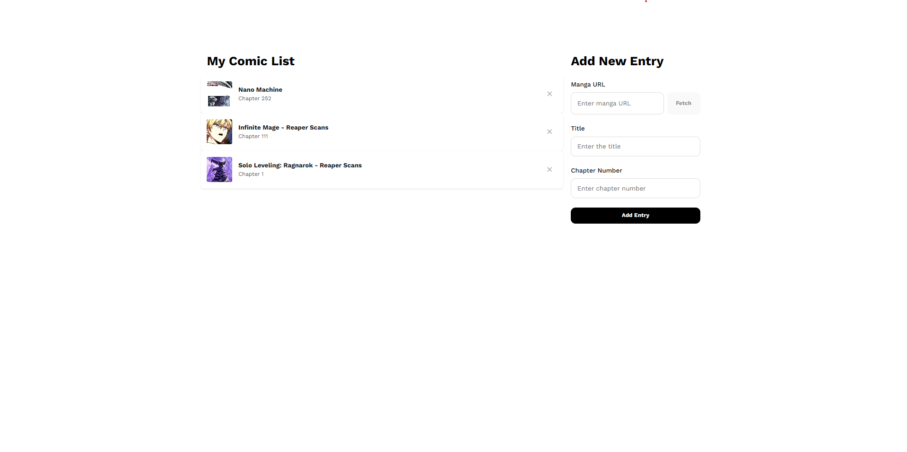
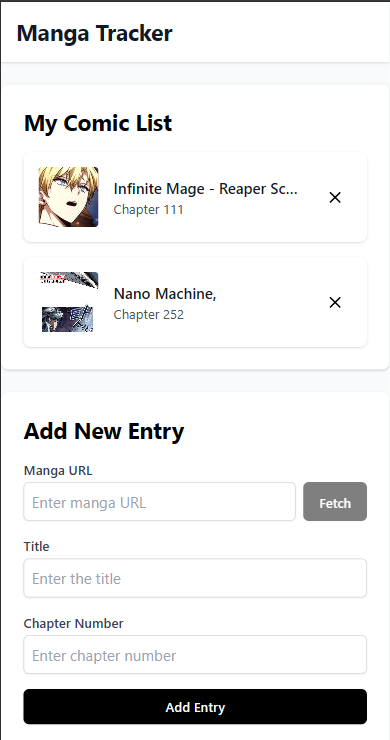

# 📚 My Manga Tracker ✨

Hey there, fellow manga enthusiast! 👋 Welcome to My Manga Tracker, a super cool web app that helps you keep track of all your favorite manga series in one place. Works beautifully on both desktop and mobile devices! 📱💻

## ✨ Features

- 🔍 Easy manga search with URL scraping
- 📖 Track your reading progress by chapter
- 🖼️ Beautiful cover images for each manga
- 🔗 Quick links to read your manga
- ✅ Simple and clean interface
- 🚀 Fast and responsive design
- 📱 Fully mobile-responsive - use on any device!

## 📸 Screenshots

### Main Interface

*The main interface shows your manga list on the left and the add form on the right*

### Mobile View

*The responsive mobile interface adapts perfectly to smaller screens*

## 🚀 Getting Started

1. Clone this repository:
```bash
git clone https://github.com/yourusername/manga-tracker.git
```

2. Install dependencies:
```bash
# Install backend dependencies
cd backend
npm install

# Install frontend dependencies
cd ../frontend
npm install
```

3. Start the development servers:
```bash
# Start backend (in backend directory)
npm run dev

# Start frontend (in frontend directory)
npm run dev
```

4. Open your browser and visit:
```
http://localhost:5174
```

## 📱 Mobile Usage

You can access your manga tracker on any smartphone or tablet:

1. Make sure your device is connected to the same network as your development machine
2. Find your computer's local IP address (usually starts with 192.168.x.x)
3. On your mobile device, visit: `http://[your-local-ip]:5174`

For production deployment, simply access your hosted URL from any device!

## 🛠️ Built With

- ⚛️ React - Frontend framework
- 🎨 Tailwind CSS - Styling
- 📡 Express - Backend server
- 🗄️ Supabase - Database
- 🔄 Axios - HTTP client
- 🕷️ Cheerio - Web scraping
- 📱 Responsive design - Works on all devices

## 💡 Tips

- 📝 You can add manga directly by pasting the URL
- 🔄 Click the manga title to go to the reading page
- ❌ Remove manga from your list with one click
- 🖼️ Cover images are automatically fetched
- 📱 Rotate your device for the best viewing experience

## 🤝 Contributing

Feel free to contribute! Whether it's:
- 🐛 Reporting a bug
- 💡 Suggesting new features
- 🔧 Submitting a fix
- 📚 Improving documentation

## 📫 Contact

Got questions? Feel free to reach out!

---

Made with ❤️ for manga lovers

*Note: Please replace `screenshots/main-interface.png` and `screenshots/mobile-view.png` with actual screenshots of your application.* 